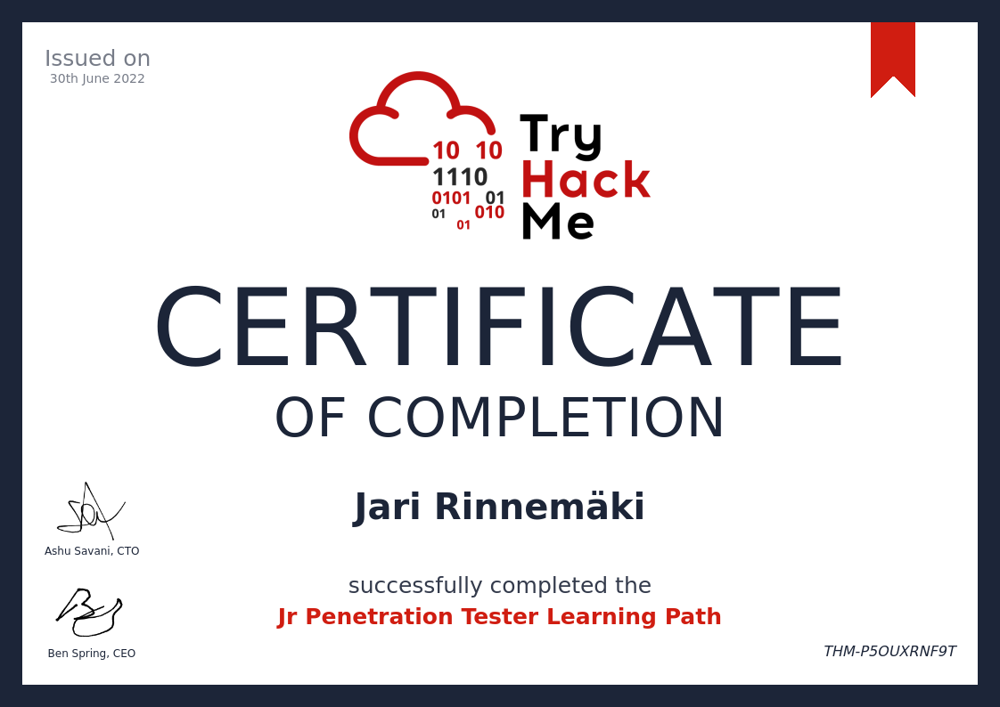
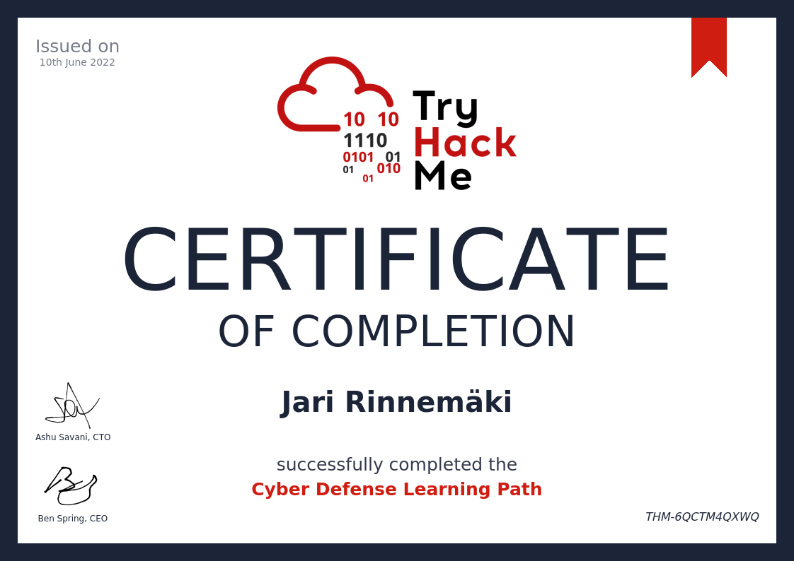
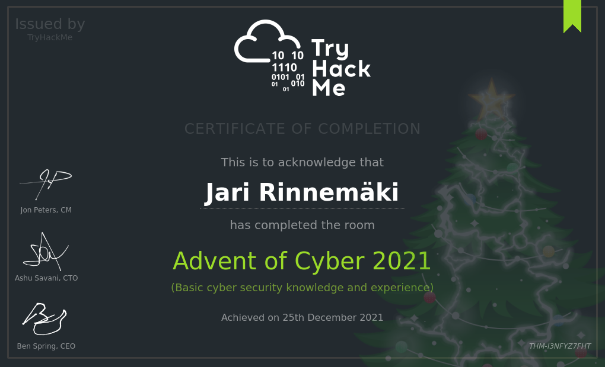
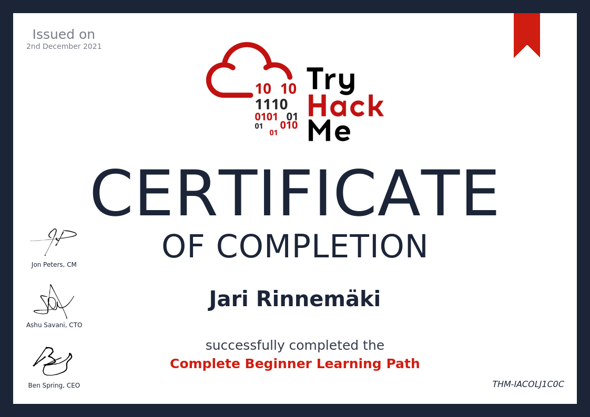
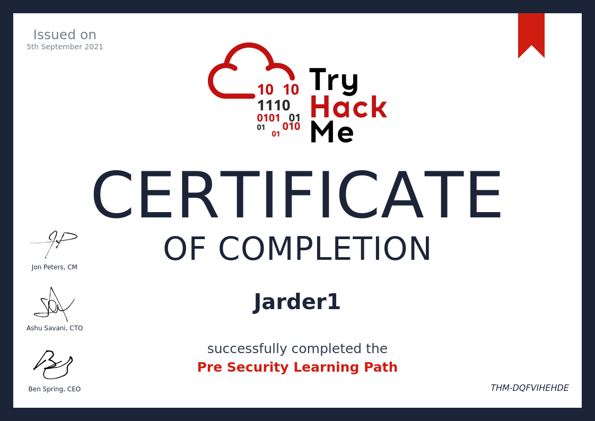
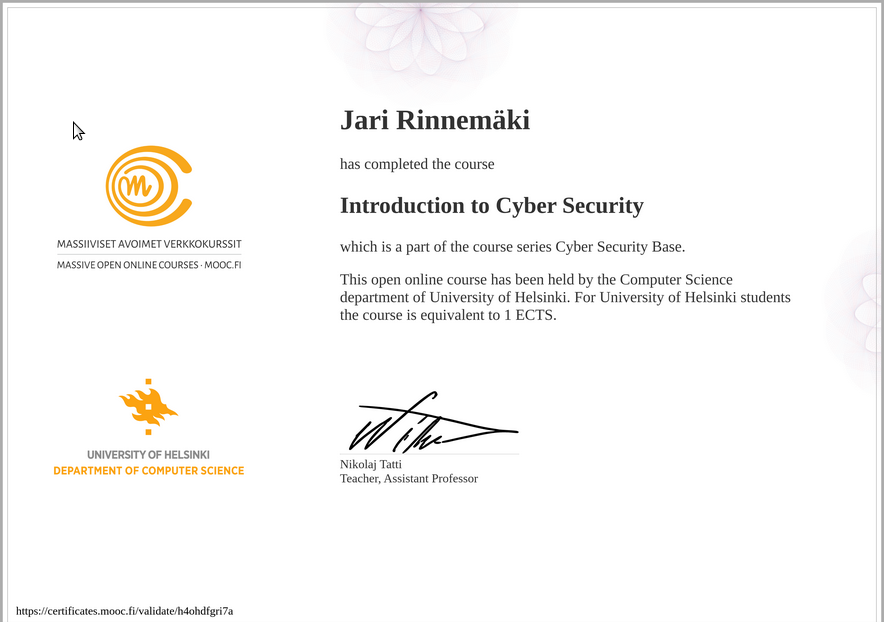
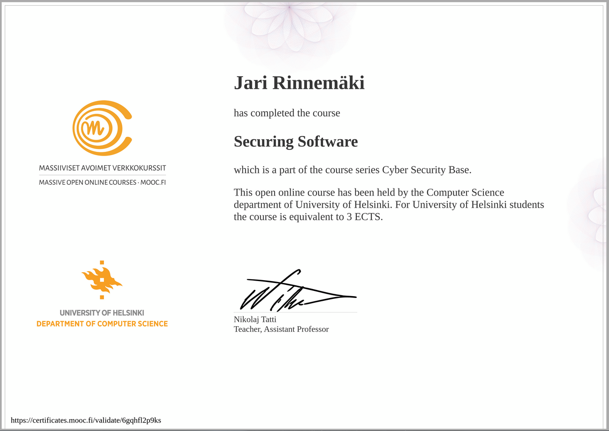

# CyberSecurity

I'm learning cybersecurity and here's my personal memo and some mixed files about the topic. This is just for me to keep up what I have learned and done **outside my formal studies** at JAMK. 

## Table of contents
0. [Milestones](#Milestones)
1. [Nixu challenges](./NIXU/nixu.md)
2. [Try hack me](#TryHackMe)
3. [Hackaday-U](#Hackday-U)
4. [OverTheWire](#OverTheWire)
5. [Misc](#Misc)
6. [Mooc.fi](#Mooc)

# Milestones

**Next goals:**

* JAMK formal studies May - 2025.

* Azure knowledge, some certificate? - December 2025

* Go back to doing more cyber related CTF-challenges or studies

Former goals [here](miles_stones_archive.md)

# DONE:

# NIXU Challenges:

[Here](./NIXU/nixu.md)

# TryHackMe

[Vulnversity task 4](./THM/john_h.py)

# Hackday-U

[Hackday-U Reverse engineering class](./HADU/hackaday.md)

[Best beginner material - for ex. Introduction to Reverse engineering playlist](https://www.youtube.com/c/DrJoshStroschein)

# Something completely different

### OverTheWire

Bandit challenge done up to the level 21. Did this as a part of Linux course in JAMK. Do more challenges/paths to re-enforce learning after THM paths are done.

[Bandit](./OTW/bandit.txt)

### Misc

[Oneplus N100](./MISC/oneplus.md)

# Mooc

### Intro course - done

### Securing Software - done

